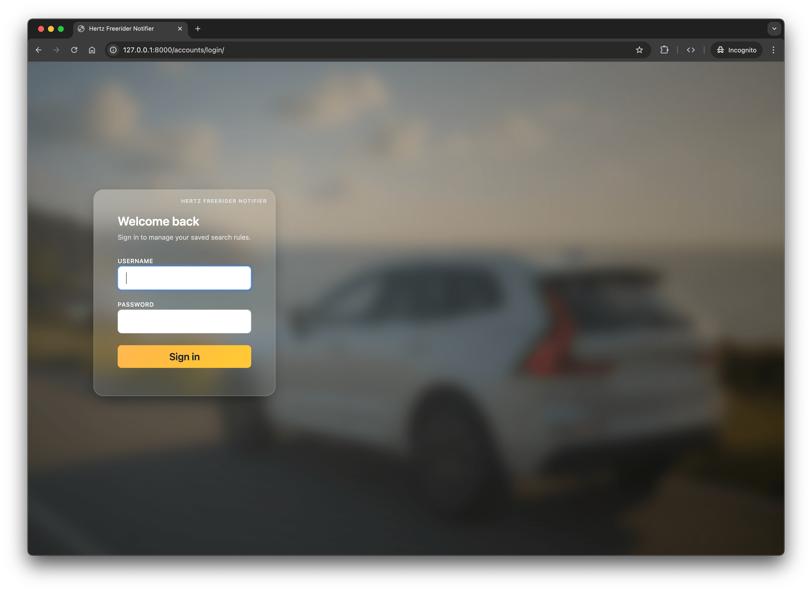
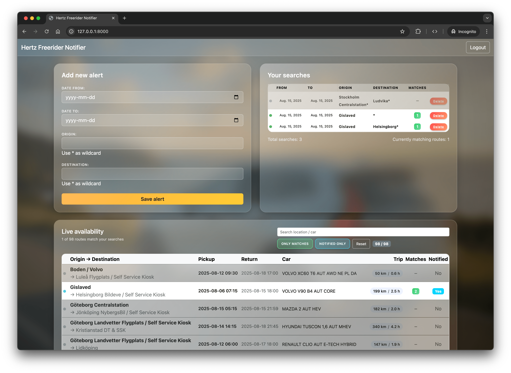
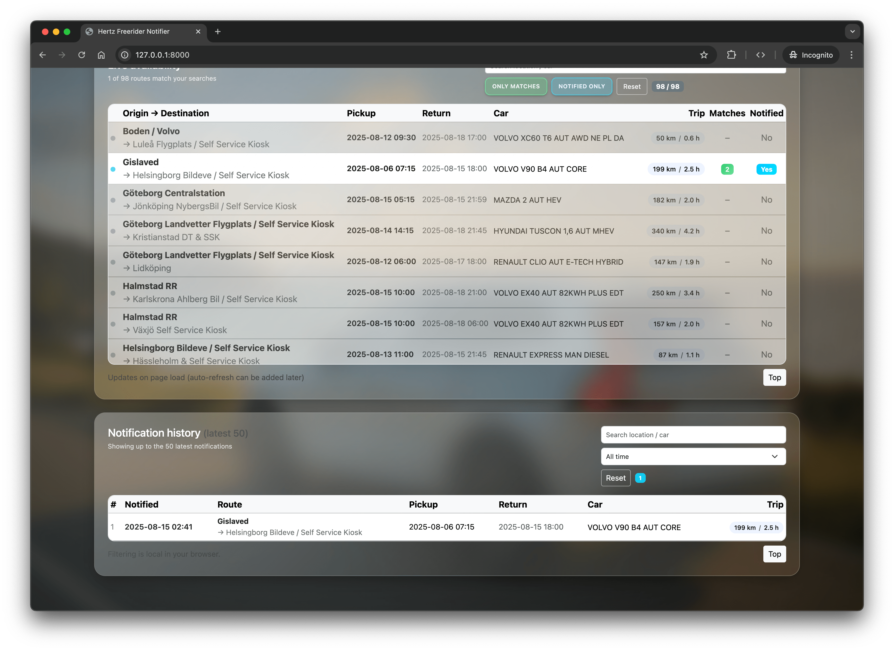
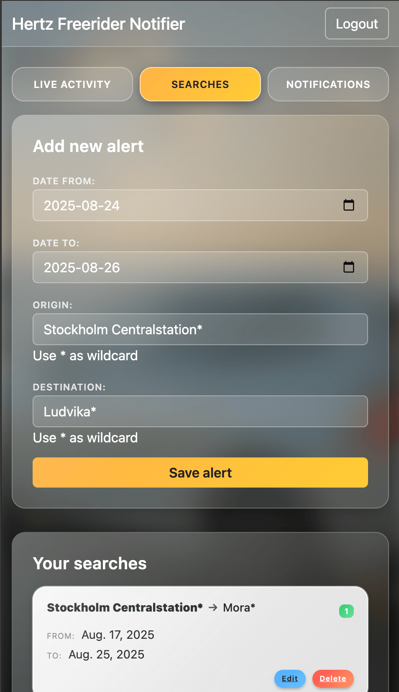

# Hertz Freerider Notifier

A Django & Celery based solution that monitors Hertz Freerider every 2 minutes and sends Pushover alerts whenever a car that matches your saved searches becomes available.

## Features

* **Pushover notifications** – one alert per unique ride (no spam).
* **Dockerized** – includes PostgreSQL, Redis, Celery worker & beat.
* **Secure authentication** – uses Django’s built‑in auth.

## Screenshots

### Desktop
<p align="center">
   <a href="docs/img/screenshot_login.png" target="_blank" title="Desktop – Login"></a>
   <a href="docs/img/screenshot_dashboard_01.png" target="_blank" title="Desktop – Searches & live availability"></a>
   <a href="docs/img/screenshot_dashboard_02.png" target="_blank" title="Desktop – Notification history"></a>
</p>
<p align="center" style="margin-top:-6px;">
   <sub><strong>Left → Right:</strong> Login · Searches + Live availability · Notification history</sub>
</p>

### Mobile
<p align="center">
   <a href="docs/img/screenshot_mobile_01.png" target="_blank" title="Mobile – Searches list"></a>
   <a href="docs/img/screenshot_mobile_02.png" target="_blank" title="Mobile – Live availability"></a>
</p>
<p align="center" style="margin-top:-6px;">
   <sub><strong>Mobile:</strong> Live availability feed · Searches management</sub>
</p>

<p align="center"><em>Click any image to open its full-size version.</em></p>

## Prerequisites

- Docker and Docker Compose
- A Pushover account (for notifications)

## Setup Instructions

### 1. Clone and setup environment

```bash
git clone https://github.com/cr3ation/hertz-freerider-notifier.git
cd hertz-freerider-notifier
```

### 2. Configure environment variables

Copy the sample environment file and edit it with your settings:

```bash
cp .env.sample .env
```

Edit `.env` and update these important variables:
- `PUSHOVER_USER` - Your Pushover user key
- `PUSHOVER_TOKEN` - Your Pushover app token  
- `SECRET_KEY` - A secure random string for Django (generate one with the command below)
- `DB_PASS` - A secure password for the database
 - (Optional) `APP_PORT` / `APP_DEBUGPY_PORT` if the defaults 8000 / 5678 clash on your system
 - (Optional) `CSRF_TRUSTED_ORIGINS` (comma-separated, full scheme+host) e.g. `https://mydomain.com,https://app.mydomain.com`

Generate a new Django secret key:

```bash
python -c "from django.core.management.utils import get_random_secret_key; print(get_random_secret_key())"
```

### 3. Start the application

```bash
docker compose up --build -d
```

This will automatically:
* Build images & install dependencies
* Start services:
   * app (Django, port `$APP_PORT` – defaults to 8000)
   * db (PostgreSQL)
   * redis (broker / cache)
   * worker (Celery worker)
   * beat (Celery beat scheduler – runs every 120s)
* Run migrations
* Create a default superuser (if missing)
* Collect static files (served via WhiteNoise)

### 4. Access the application

Open <http://localhost:8000> — you will be redirected to the login page (`/accounts/login/`) if not authenticated. Log in with:
- **Username**: `admin`
- **Password**: `admin123`

You can now start adding search rules!

## Troubleshooting

### Database Connection Issues

If you see database authentication errors, you may have old database data. Clean up and restart:

```bash
docker compose down
docker volume rm hertz_freerider_notifier_postgres_data
docker compose up --build -d
```

The application will automatically recreate the database and admin user.

### Check Service Status

View running containers:
```bash
docker ps
```

View logs for specific services:
```bash
docker compose logs app
docker compose logs worker
docker compose logs beat
docker compose logs db
```

### Reset Admin Password

If you need to change the admin password:

```bash
docker compose exec app python manage.py shell -c "
from django.contrib.auth.models import User
user = User.objects.get(username='admin')
user.set_password('new_password')
user.save()
print('Password updated')
"
```

### Create Additional Users

To create additional admin users:

```bash
docker compose exec app python manage.py createsuperuser
```

## Environment variables

| Name | Description | Default |
| ---- | ----------- | ------- |
| `SECRET_KEY` | Django secret key | `changeme` |
| `DEBUG` | Debug mode (0 or 1) | `0` |
| `APP_PORT` | Host port exposed for Django web app | `8000` |
| `APP_DEBUGPY_PORT` | Host port for Django debugpy (when `DEBUG=1`) | `5678` |
| `DB_NAME` | Database name | `db` |
| `DB_USER` | Database username | `devuser` |
| `DB_PASS` | Database password | `changeme` |
| `DB_HOST` | Database host | `db` |
| `DB_PORT` | Database port | `5432` |
| `ALLOWED_HOSTS` | Allowed hosts (comma-separated) | `127.0.0.1,localhost` |
| `CSRF_TRUSTED_ORIGINS` | Comma-separated list of trusted origins (include scheme) for CSRF protection | - |
| `PUSHOVER_USER` | Your Pushover user key | - |
| `PUSHOVER_TOKEN` | Your Pushover app token | - |
| `DJANGO_SUPERUSER_USERNAME` | Auto-created admin username (if absent) | `admin` |
| `DJANGO_SUPERUSER_PASSWORD` | Auto-created admin password (if absent) | `admin123` |
| `CELERY_BROKER_URL` | Redis URL for Celery | `redis://redis:6379/0` |

See `.env.sample` for the complete configuration template.

## How It Works

1. **Celery Beat** runs every 2 minutes (120s) and triggers the monitoring task
2. **Celery Worker** executes the task that:
   - Fetches available rides from Hertz Freerider API
   - Compares them against your saved search criteria
   - Sends Pushover notifications for new matches
   - Records notified rides to prevent duplicate alerts
3. **Django Web App** provides the user interface for managing search rules

### Manual Testing (trigger task immediately)

For testing purposes, you can manually trigger the monitoring task instead of waiting for the 2-minute schedule:

```bash
# Trigger the task immediately
docker compose exec app python manage.py shell -c "from scheduler.tasks import check_hertz; check_hertz.delay()"
```

This is useful when:
- Testing your search configurations
- Debugging notifications
- Verifying the system is working correctly

You can monitor the task execution by watching the worker logs:

```bash
docker compose logs -f worker
```

## Development

To make changes to the code:

1. Edit files locally
2. Restart the relevant services:
   ```bash
   docker compose restart app worker beat
   ```

To view real-time logs:
```bash
docker compose logs -f worker beat
```

### Celery Worker Debugging

The worker entrypoint (`entrypoint-worker.sh`) includes built-in debug support via `debugpy`.

Enable it by starting the stack with `DEBUG=1` in your `.env` (or override at compose runtime). When `DEBUG=1`:
* The Django app runs with `debugpy` on container port 5678 (host 5678).
* The Celery worker runs with `debugpy` on container port 5678 but is mapped to a different host port (see `docker-compose.yml`, e.g. `5679:5678`).

Attach from VS Code:
1. Open the Run and Debug panel.
2. Use "Python: Remote Attach" (host: `localhost`, port: `5678` for app or `5679` for worker).
3. Set breakpoints in task code (e.g. `scheduler/tasks.py`).

Optional: To make the worker wait for the debugger before executing code, edit `entrypoint-worker.sh` and add `--wait-for-client` after the `--listen 0.0.0.0:5678` argument.

When you’re done debugging, set `DEBUG=0` and restart the affected services to return to normal (Gunicorn + plain Celery worker) mode.

## Authentication & Redirects

After a successful login you are redirected to the dashboard (`/`). Visiting the login page while already authenticated will also redirect you to the dashboard (configured via `redirect_authenticated_user=True` and `LOGIN_REDIRECT_URL`).

## Theming / UI Adjustments

All glass / background styling lives in `scheduler/static/scheduler/css/app.css`.

Useful tweaks:
* Background brightness: adjust `--bg-brightness` in the `:root` section.
* Change background image by replacing `background_03.png` under `scheduler/static/img/` (keep filename) or updating the `.bg-image` rule.
* Filter button styles: selectors `#toggleShowMatches` & `#toggleShowNotified`.

## Security Notes

Before exposing publicly:
* Change `SECRET_KEY` and admin password.
* Set `DEBUG=0`.
* Restrict `ALLOWED_HOSTS`.
* Consider enabling HTTPS (reverse proxy / load balancer) and stronger password policies.

## Roadmap Ideas

* Auto-refresh live availability (AJAX / HTMX / SSE)
* Edit saved searches in place
* Optional dark / light theme toggle
* Rate limiting & monitoring dashboard

